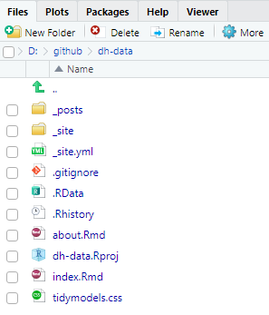
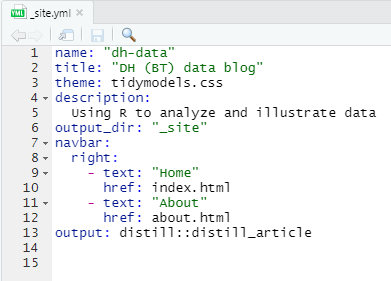

### Goodbye Blogdown (+hugo), hello Distill 

My current (soon to be previous) [data blog is a blogdown site](https://www.davidsdatablog.com/). The setup/installation of [blogdown was not difficult](https://www.linkedin.com/posts/bionicturtle_rstats-datascience-frm-activity-6708062373758038016-lC7h), but it is a PITA to maintain; e.g., new ggplot images aren't rendering on the last package update. On Sunday after hours trying to fix the blogdown configuration, I even resorted to hiring quick help at codementor.com for the first time in my life, but even their expert could not fix the problem. The first time it was pretty straightforward, and [it should still be](https://www.apreshill.com/blog/2020-12-new-year-new-blogdown/), but after searching to debug my problem, I observed that I was not alone in my frustration with blogdown. I figured, there MUST be a better way to simply share data analyses (without going to Rpubs, I mean)?

Then I stumbled onto [Lisa Lendway's post](https://distillery.rbind.io/posts/2021-02-08-distill-it-down/). She also had a "blogdown fail!" and she explains why she switched to the [distill package](https://pkgs.rstudio.com/distill/). How did I miss this revelation?! Boom. This setup here took me a grand total of 15 minutes to install. No glitches! Distill is light-weight and somewhat customizable; e.g., I  borrowed the tidymodels.css stylesheet and changed my titles to CeriFi's color (#193053) because, you know, color makes me happy. No mess. No fuss. Here are the basic steps:

1. Install distill package and build site with create_website (ype, one line of code!)
2. Create a local git repo (at the distill directory just created) and connect that to a remote GitHub repo; [mine is here](https://github.com/bionicturtle/dh-data). So this github repo is remote a copy of the webite
3. Use the [netlify](https://www.netlify.com/) to publish from the _site sub-directory. Netflify is amazing. 

Adding a blog entry is easy:

1. create_post(title = "I love distill because it's easy and it works!") which is an RMarkdown file
2. Knit the post (to view locally); article must be knitted individually
3. When ready, "Build Website" in RStuio's Build pane; i.e., executes rmarkdown::render_site()
4. Commit and push to github. Netlify allows for continous deployment if you build from the github repo and specify _site as the Publish directory 

### Distill's lightweight file structure

With the command create_website(), a simple file structure is created:

{width=50%}

The _site.yml contains the reference to the theme.css. I borrowed the [tidymodels.css](https://rstudio.github.io/distill/website.html#example-themes) theme with only a color change.

{width=60%}

