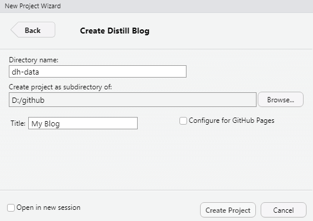

My current (soon previous) [data blog is a blogdown site](https://www.davidsdatablog.com/). But blogdown is a PITA to maintain; e.g., new plots broke on the last package update. On Sunday after hours trying to fix the blogdown configuration, I even resorted to hiring quick help at codementor.com for the first time in my life, but even their expert could not fix the problem. The first time it was pretty straightforward, and [it should still be](https://www.apreshill.com/blog/2020-12-new-year-new-blogdown/), but after searching to debug my problem, I observed that I was not alone in my frustration with blogdown. I figured, there MUST be a better way to simply share data analyses (without going to Rpubs, I mean)?

Then I stumbled onto [Lisa Lendway's post](https://distillery.rbind.io/posts/2021-02-08-distill-it-down/). She also had a "blogdown fail!" and she explains why she switched to the [distill package](https://pkgs.rstudio.com/distill/). How did I miss this revelation?! Boom. This setup here took me a grand total of 15 minutes to install. No glitches! Distill is light-weight and somewhat customizable; e.g., I  borrowed the tidymodels.css stylesheet and changed my titles to CeriFi's color (#193053) because, you know, color makes me happy. No mess. No fuss. Here are the basic steps:

1. Install distill package and build site with create_website (one line of code)
2. Create a local git repo (at the directory we just created) and connect that to a remote GitHub repo; [mine is here](https://github.com/bionicturtle/dh-data) and so this github repo is basically a copy of this webite
3. Use the [netlify](https://www.netlify.com/) to publish from the _site sub-directory. If Netflify goes public, I will be buying their shares :)

Detailed steps TBD here

{width=60%}

Learn more about using Distill at <https://rstudio.github.io/distill>.

