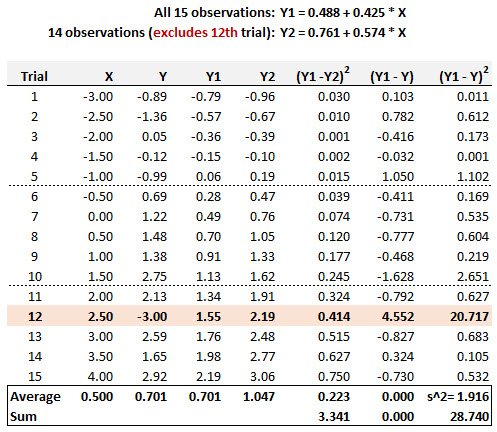
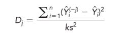

20.20.1. Below are displayed 15 pairwise (X,Y) trials. The simple regression line based on all 15 observations is given by Y1 = 0.488 + 0.425\*X. We consider the possibility that the 12th Trial, given by point (X = 2.50, Y = -3.00) might be an outlier. If this point is removed, then the regression based on the other 14 observations is given by Y2 = 0.761 + 0.574\*X. These results are displayed, including selected summary statistics.

{width=75%}

According to Cook's distance, is the 12th Trial an outlier?

> a. No, because its Cook's distance is negative
b. No, because its Cook's distance is 3.341/(2*1.916) = 0.872
c. Yes, because its Cook's distance is +0.15 (as given by the slope change)
d. Yes, because its Cook's distance is 1.916/(2*0.223) = +4.301

Cook's distance measures the sensitivity of the fitted values to dropping a single observation and is given as follows by D(j)

{width=30%}

In this case, the numerator is displayed on the given table (i.e., 3.341), and also displayed is the estimate of the error variance, s^2 = 1.916. As this is univariate regression, k = 2 coefficients. The Cook's distance is therefore given by 3.341/(1.916*2) = 0.872. Because this is less than 1.0, we do not view the 12th trial as an outlier.
