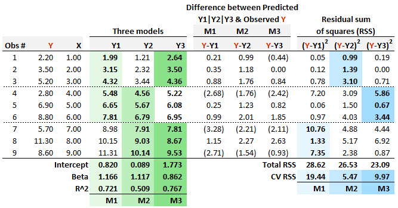

### m-fold cross-validation 

Our question P1-T2-20-2 that is [located here](https://forum.bionicturtle.com/threads/p1-t2-20-20-regression-diagnostics-outliers-cooks-distance-m-fold-cross-validation-and-residual-diagnostics.23498/) mimics GARP's approach in their Chapter 9; in particular their solution 9.14. However, it makes the mistake of using cross-validation to select the regression coefficients. The problem with this approach is simple: the entire dataset is not used to fit the model. 

Here are two helpful resources:

* Introduction to Data Science (Data Analysis and Prediction Algorithms with R) by Rafael A. Irizarry at https://rafalab.github.io/dsbook/cross-validation.html#k-fold-cross-validation 
* The answer at https://stats.stackexchange.com/questions/52274/how-to-choose-a-predictive-model-after-k-fold-cross-validation

In the stackexhange Bogdanovist explains that "the purpose of cross-validation is not to come up with our final model. We don't use these 5 instances of our trained model to do any real prediction. For that we want to use all the data we have to come up with the best model possible. The purpose of cross-validation is model checking, not model building."

In this way training different linear regression coefficients is NOT training multiple models. In the example below, there are not three models, there is one model. The one model is the dead-simple univariate regression: lm(Y ~ X, data). The purpose of cross-validation is to estimate the error, it is NOT to calibrate the coefficients by using two-thirds (i.e., 6 of 9) of the dataset. 


```{r message=FALSE, warning=FALSE}

library(tidyverse)

obs <- tibble(
    X = c(1.00, 2.00, 3.00, 4.00, 5.00, 6.00, 7.00, 8.00, 9.00), 
    Y = c(2.20, 3.50, 5.20, 2.80, 6.90, 8.80, 5.70, 11.30, 8.60)
)

testrows_M1 <- 1:6; testrows_M2 <- 4:9; testrows_M3 <- c(1:3, 7:9)
train_M1 <- obs[testrows_M1, ]; test_M1 <- obs[-testrows_M1, ]
train_M2 <- obs[testrows_M2, ]; test_M2 <- obs[-testrows_M2, ]
train_M3 <- obs[testrows_M3, ]; test_M3 <- obs[-testrows_M3, ]

model_M1 <- lm(Y ~ X, train_M1)
model_M2 <- lm(Y ~ X, train_M2)
model_M3 <- lm(Y ~ X, train_M3)

predict_M1 <- predict(model_M1, test_M1, type = "response")
predict_M2 <- predict(model_M2, test_M2, type = "response")
predict_M3 <- predict(model_M3, test_M3, type = "response")

error_M1 <- test_M1$Y - predict_M1
error_M2 <- test_M2$Y - predict_M2
error_M3 <- test_M3$Y - predict_M3

CV_RSS_M1 <- sum(error_M1^2) # GARP's selection metric
CV_RSS_M2 <- sum(error_M2^2)
CV_RSS_M3 <- sum(error_M3^2)

df <- nrow(obs) - 2 # df = n - k, where k is no. of coefficients
# sample too small, not using

RMSE_M1 <- sqrt(mean(error_M1^2))
RMSE_M2 <- sqrt(mean(error_M2^2))
RMSE_M3 <- sqrt(mean(error_M3^2))

RMSE_M1
RMSE_M2
RMSE_M3

library(caret)

model_cv <- train(
  Y ~ X, 
  obs,
  method = "lm",
  trControl = trainControl(
    method = "cv", 
    number = 3,
    verboseIter = TRUE
  )
)

# Notice how caret builds the final regression model on the full dataset. 
# CV is to estimate the out-of-sample error; the folded models are "disposed"
# We are not REALLY comparing three different models; there is only one model here
# CV is to check the model not build the model
# And intuitively: we want to use all the data to fit the model.

model_cv$finalModel
model_full <- lm(Y~ X, obs)
model_full

```


### BT PQ P1.T2.20.20.2 CV to select best regression model

20.20.2. Patricia needs to specify a regression model, but she is only given nine (Y,X) pairwise observations, as displayed below. She employs m-fold cross-validation (CV) and selects three folds (aka, three blocks). Each of her three candidate regression models is "trained" on two of the folds, so that model can be "tested" on the remaining fold. The first model (M1 in light green) is a regression that is "trained" on the first six observations, and it is given M1: Y1 = 0.820 + 1.166/* X. The second model (M2 in slightly darker green) is a regression that is "trained" on the last six observations, and it is given M2: Y2 = 0.089 + 1.117/* X. The third model (M3 in darkest green) is a regression that is "trained" on the first three and last three observations, and it is given M3: Y3 = 1.1773 + 0.862*X.



For each model, the residual (i.e., the difference between the predicted and observed Y) is displayed. The final three columns display the squared residuals. If her criteria for model selection follows the principles of m-fold cross-validation then which of the three models should Patricia select?

> a. She should select M1 because it has the highest CV RSS
b. She should select M2 because it has the lowest CV RSS
c. She should select M3 because it has the highest coefficient of determination
d. She should select M3 because it has the lowest total RSS

Answer [here in forum](https://forum.bionicturtle.com/threads/p1-t2-20-20-regression-diagnostics-outliers-cooks-distance-m-fold-cross-validation-and-residual-diagnostics.23497/) 
