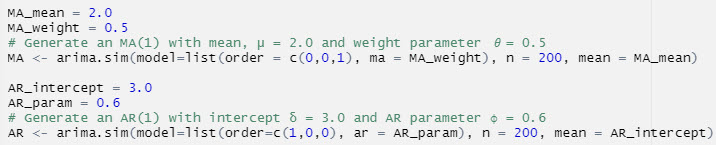
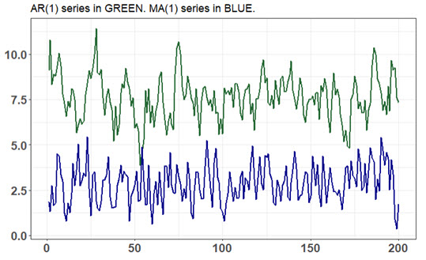

## P1.T2.20.22. Stationary Time Series: autoregressive (AR) and moving average (MA) processes

### Learning objectives

* Define and describe the properties of autoregressive (AR) processes. 
* Define and describe the properties of moving average (MA) processes. 
* Explain how a lag operator works.

20.22.2. The following code simulates an autoregressive (AR) processes and a moving average (MA) process. The key argument is order=c(p, d, q): p is the AR order (i.e., the number of autoregressive terms), d is the number of nonseasonal differences, and q is the MA order. The "n = 200" argument specifies the length of the simulation. The MA(1) simulation is achieved with c(0, 0, 1) and the AR(1) simulation is achieved with c(1, 0, 0). In both processes, the random shock is white noise: e(t) ~ WN(0, 1) with unit variance.


Below is a plot of the two simulations:


About these AR(1) and MA(1) simulations, each of the following statements is true EXCEPT which is false?

> a. The MA(1) process has a mean of 2.0
b. The AR(1) process has a long-run (aka, unconditional) mean of 7.50
c. Both of these AR(1) and MA(1) processes are covariance-stationary
d. Both the these AR(1) and MA(1) processes have unconditional variances of 1.0


```{r}
library(tidyverse)

set.seed(25)

MA_mean = 2.0
MA_weight = 0.5
# Generate an MA(1) with mean, μ = 2.0 and weight parameter 𝜃= 0.5
MA <- arima.sim(model=list(order = c(0,0,1), ma = MA_weight), n = 200, mean = MA_mean)

AR_intercept = 3.0
AR_param = 0.6
# Generate an AR(1) with intercept δ = 3.0 and AR parameter ϕ = 0.6 
AR <- arima.sim(model=list(order=c(1,0,0), ar = AR_param), n = 200, mean = AR_intercept)

color_AR = "#266935"
color_MA = "darkblue"

time_ma_ar <- bind_cols(MA, AR) %>% rowid_to_column() %>% 
  rename(y_MA = ...1, y_AR = ...2)
time_ma_ar %>% ggplot(aes(x = rowid)) + 
  theme_bw() + 
  theme(
    axis.title.y = element_blank(),
    axis.title.x = element_blank(),
    axis.text = element_text(size = 14, face = "bold"),
    legend.position = c(0.8, 0.86)
  ) + 
  ggtitle("AR(1) series in GREEN. MA(1) series in BLUE.") + 
  geom_line(aes(y = y_AR), color = color_AR, size = 1) +
  geom_line(aes(y = y_MA), color = color_MA, size = 1) +
  scale_y_continuous(breaks = c(0, 2.5, 5.0, 7.5, 10, 12.5))
  # scale_color_manual(name = "Simulations with arima.sim()", labels=c("MA(1)", "AR(1)"))

# MA mean is intercept
lr_mean_AR <- AR_intercept/(1 - AR_param)
variance_MA <- (1 + MA_weight^2)*1
variance_AR <- 1/(1 - AR_param^2)

lr_mean_AR
variance_MA
variance_AR

```


### end of post
