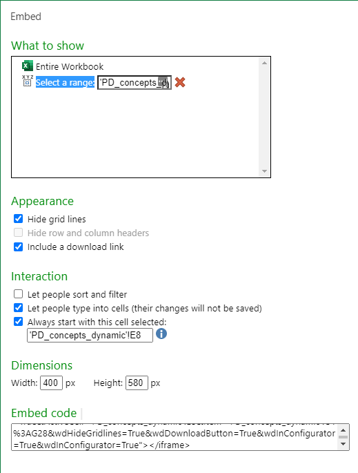

This is a distill blog per my [brief introduction](https://dh-data.org/posts/2022-01-11-new-distill-site-in-15-minutes/). Each post (like this) is an RMarkdown file (.Rmd) which is ideal (designed for) for embedding code chunks in notebooks. The Rmd is knitted/rendered to HTML. I'm sure what I did here is NOT the most efficient: I inserted the iframe into the post-rendered HTML file, rather than the pre-processed RMD, then built/pushed the page. 

### Illustration of default probability (PD) concepts

I built this simple sheet to reconcile the many PD concepts that swirl around the FRM candidate in the credit (T6) topic. The ONLY input(s) is the hazard rate (aka, default intensity): the cell should default to this input at E8. The rest of the PDs are calculated. Also, notice how the NOTES are dynamically updated. It's easy in Excel to create such fields by concatenating with TEXT(G10,"0.0%"). 

Here are the generic options:

